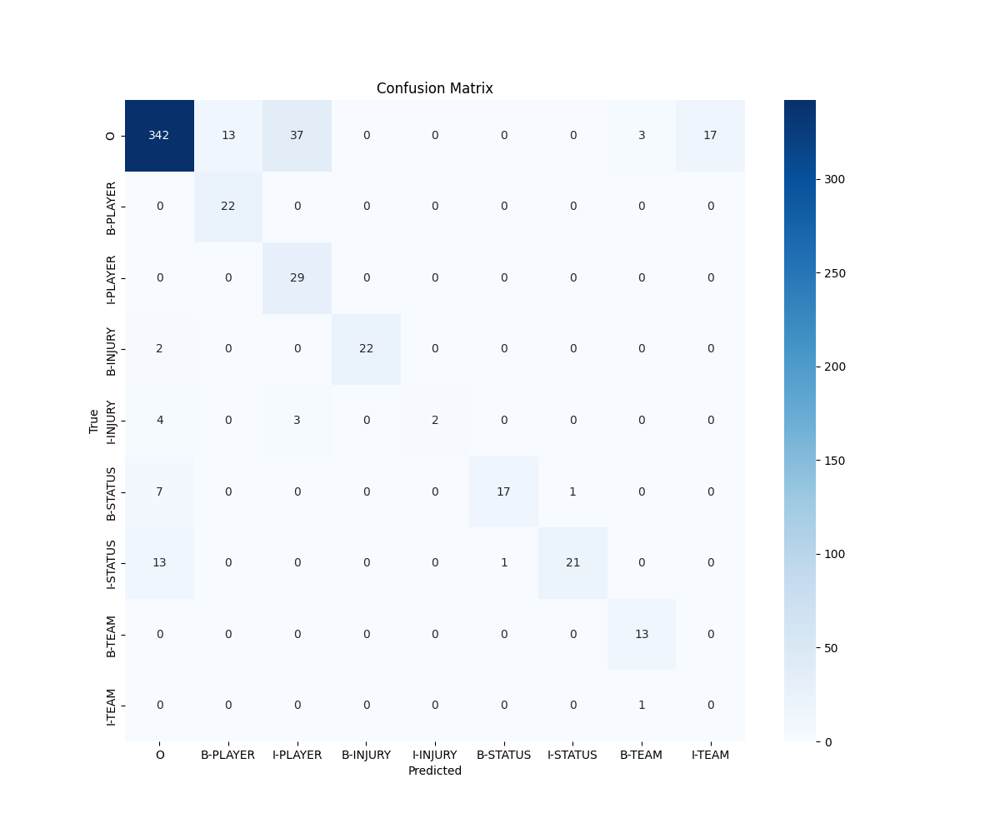

# Development Guide

## Workflow

1. **Generate Data** (`src/sportsinjuryner/train/01_convert_csv_to_ner_data.py`)
    * Combines CSV (`src/data/injuries_espn.csv`) and JSON (`src/data/feed.json`) data.
    * Uses `dslim/bert-large-NER` for initial Player/Team detection.
    * Uses keyword matching for Injury and Status.
    * Outputs `src/data/train.jsonl`, `src/data/dev.jsonl`, and `src/data/test.jsonl`.
    * Run: `uv run python src/sportsinjuryner/train/01_convert_csv_to_ner_data.py`

2. **Validate Data** (`src/sportsinjuryner/train/02_validate_ner_data.py`)
    * **Optional but Recommended**: Manual review of auto-generated tags to create a "Gold Standard".
    * Run: `uv run python src/sportsinjuryner/train/02_validate_ner_data.py`
    * This creates `src/data/gold_standard.jsonl`.

3. **Train Model** (`src/sportsinjuryner/train/03_train_injury_ner.py`)
    * Fine-tunes `microsoft/SportsBERT` on the generated data.
    * Uses `gold_standard.jsonl` for validation if available (fallback to `dev.jsonl`).
    * Run: `uv run python src/sportsinjuryner/train/03_train_injury_ner.py`
    * Dry Run (verify pipeline): `uv run python src/sportsinjuryner/train/03_train_injury_ner.py --dry-run`

## Testing

* **Unit Tests**: Run the test suite to verify utilities and alignment logic.
    * Run: `uv run pytest`

## MLflow & Training Artifacts

* **MLflow UI**: View training metrics and artifacts (confusion matrices).
    * Run: `uv run mlflow-ui` (uses SQLite backend)
* **Local Reports**: Training artifacts are also saved locally to `reports/`.
    * `reports/metrics.json`

### Model Performance

## Key Files

* `main.py`: Main entry point for testing NER models.
* `src/sportsinjuryner/train/03_train_injury_ner.py`: Reference implementation for fine-tuning SportsBERT.
* `src/sportsinjuryner/train/00_load_injuries_data.py`: Data collection script (ESPN scraper + RSS feeds).
* `src/sportsinjuryner/loaders/feedsreader.py`: RSS feed configuration and loader.
